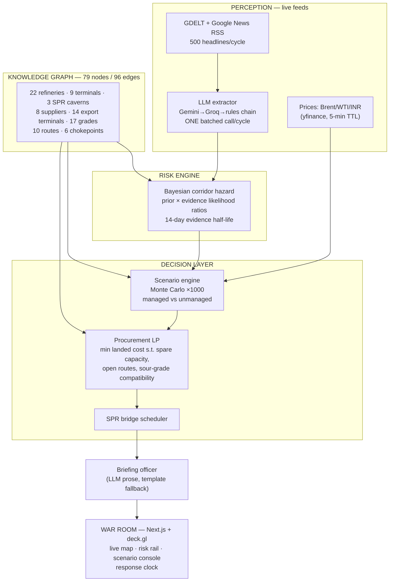

# ARGUS — Energy Supply Chain Resilience Intelligence

**ET AI Hackathon 2.0 · Problem Statement 2: AI-Driven Energy Supply Chain Resilience for Import-Dependent Economies**

India imports **88%** of its crude oil. **~40%** of it sails through one strait 3,000 km away.
When that strait hiccups, your petrol price moves within days — and today, the national response
is assembled by hand, over phone calls, after the price has already moved.

**ARGUS is the war-room that sees it coming.** It watches the world continuously — news wires
and market prices, over a curated model of the physical supply chain — maintains a live,
probabilistic disruption risk score per
supply corridor, and when a threat materializes (or an analyst asks *"what if?"*), it simulates
the cascade through India's actual refining system and **generates an executable procurement
response** — which barrels, from which terminals, on which routes, at what landed cost — in
**under 10 seconds, end to end**.

---

## The design principle: *the LLM never does the math*

Most AI prototypes put an LLM in the middle and hope. ARGUS is **neuro-symbolic**: LLMs work
only at the edges — perception (turning 500 messy headlines into structured events) and
narration (writing the minister's briefing). Everything between is auditable computer science:

| Stage | Method | Not |
|---|---|---|
| Threat scoring | Bayesian hazard model — priors × decaying likelihood ratios | LLM vibes |
| Impact simulation | Monte Carlo (1,000 runs) over a daily supply-inventory-price model | A static spreadsheet |
| Procurement | Linear programming (CBC) over real terminals, grades, routes | "AI suggests alternatives" |
| SPR drawdown | Constrained scheduler against ISPRL infrastructure limits | A hardcoded number |
| Every parameter | [`data/assumptions.yaml`](data/assumptions.yaml) — sourced, confidence-tagged, editable | Magic constants |

## Architecture



## What makes it different

1. **It runs on the real world.** Live GDELT/RSS news (500 headlines/cycle), live Brent/WTI/INR,
   real refineries with real crude diets, real export terminals bound to the grades they actually
   load. During development it tracked the actual July 2026 Hormuz tensions unprompted.
2. **It proves its lead time instead of claiming it.** The same Bayesian engine, replayed over
   three real crises with a strict no-look-ahead harness:
   - Gulf tanker crisis → Abqaiq attack (2019): alert **125 days** before peak price impact
   - Red Sea shipping crisis (2023–24): alert **29 days** before Maersk/Hapag suspended transits
   - Iran–Israel direct escalation (Apr 2024): alert **2 days** before impact
3. **Its recommendations are executable.** Not "diversify suppliers" — an order sheet: *0.53 mb/d
   Arab Heavy ex-Yanbu via Red Sea, ETA 13.5 days, $85.86/bbl landed; 0.40 mb/d Urals ex-Baltic
   via Cape, ETA 44 days* — with coverage %, daily premium, and the SPR schedule that bridges the gap.
4. **Assumptions are the product.** Every elasticity, capacity and hazard prior lives in
   `assumptions.yaml` with source and confidence tags. Judges can change one number and watch
   the world change. Low-confidence values are *flagged*, not hidden.
5. **It survives losing its own AI.** Gemini rate-limited? → Groq. Both down? → deterministic
   rules keep extracting, template keeps briefing. A resilience platform that is itself resilient.
6. **Zero-cost stack.** Every feed and model runs on free tiers — deliberately, so the prototype
   is deployable by a PSU tomorrow without procurement.

## Response clock (measured, not aspirational)

`signal → risk repriced → 2×1000-run simulation → LP order sheet → SPR schedule → ministerial briefing`
**= 8.9 seconds** (0.4s without LLM narration). The evaluation focus asks for "demonstrated
end-to-end response time from signal to recommendation" — it's a field in our API response.

## Quickstart

```bash
# backend
cd backend && python3 -m venv .venv && .venv/bin/pip install -r requirements.txt
cp .env.example .env   # optional: add free Gemini/Groq keys for LLM extraction & briefings
.venv/bin/uvicorn app.main:app --port 8000

# frontend
cd frontend && npm install && npm run dev   # → http://localhost:3000
```

Runs fully without API keys (rules-based extraction, template briefings). With free-tier keys
([Gemini](https://aistudio.google.com/apikey), [Groq](https://console.groq.com/keys)) you get
LLM extraction and analyst-grade briefings. Usage stays within both free tiers by design
(batched extraction ≈ 100 calls/day).

## Repo map

```
data/       curated India crude-infrastructure datasets + assumptions.yaml (all sourced)
backend/    FastAPI · engines: risk, news, extractor, prices, scenario, procurement, spr,
            orchestrator, backtest · knowledge graph (NetworkX + Neo4j export)
frontend/   Next.js war room: deck.gl map, risk rail, intel feed, scenario console
docs/       BUILD_PLAN.md, IMPACT_MODEL.md, graph.cypher (Neo4j export)
```

## Honesty ledger

Prototype simplifications we would harden in production: corridor flow-splits assume even
distribution across a supplier's routes until AIS-observed splits refine them; freight is
approximated (Worldscale integration pending); SPR physical drawdown rate is an expert-judgment
parameter; retail price impact assumes full pass-through (India historically buffers via excise).
Every one of these lives in `assumptions.yaml` where it can be challenged and improved.

---
*Built for ET AI Hackathon 2.0, July 2026.*
